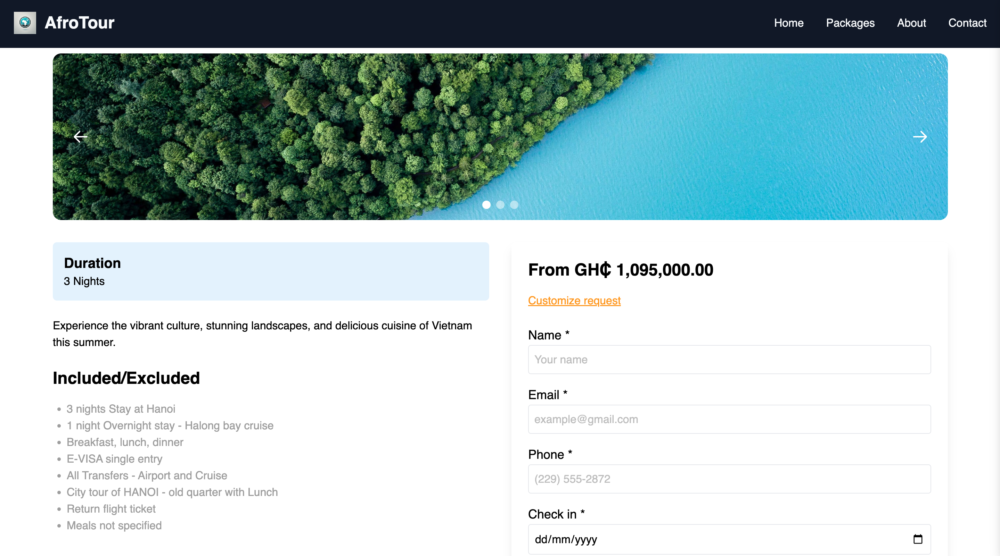

# AfroTour

Welcome to **AfroTour**, a travel platform designed to showcase the rich and diverse beauty of Africa. AfroTour aims to connect travelers to unique African destinations, experiences, and cultures while offering personalized travel recommendations.

## Table of Contents
- [Overview](#overview)
- [Features](#features)
- [Tech Stack](#tech-stack)
- [Installation](#installation)
- [Usage](#usage)
- [API Endpoints](#api-endpoints)
- [Screenshots](#screenshots)
- [Contributing](#contributing)
- [License](#license)
- [Contact](#contact)

## Overview

AfroTour is built to help tourists explore the hidden gems of Africa by providing curated travel experiences. It covers a range of destinations across the continent, offering insights on where to stay, what to do, and how to immerse yourself in the local culture.

### Key Highlights
- Discover beautiful African countries and cities.
- Personalized itineraries based on user preferences.
- Integrated with booking services for accommodations, flights, and local tours.
- Curated cultural experiences from local guides.
- Explore by categories such as nature, adventure, or history.

## Features

- **User Authentication**: Secure login and registration using OAuth or email.
- **Search Destinations**: Find destinations by country, city, or experience.
- **Recommendations**: Get personalized travel suggestions based on your preferences.
- **Book Experiences**: Reserve flights, accommodations, and tours all within the app.
- **User Reviews**: Read and submit reviews for experiences and destinations.
- **Multilingual Support**: Supports English, French, and several African languages.

## Tech Stack

- **Frontend**: React.js, Tailwind CSS
- **Backend**: Python, Flask
- **Database**: PostgreSQL
- **Authentication**: OAuth 2.0, JWT
- **API**: RESTful API built with Flask
- **Deployment**: Docker, Jenkins, AWS

## Installation

1. Clone the repository:
   ```bash
   git clone https://github.com/your-username/afrotour.git
   ```
2. Navigate to the project directory:
   ```bash
   cd afrotour
   ```

3. Set up the virtual environment and install dependencies:
   ```bash
   python3 -m venv venv
   source venv/bin/activate
   pip install -r requirements.txt
   ```

4. Set up the database:
   ```bash
   flask db init
   flask db migrate
   flask db upgrade
   ```

5. Run the app:
   ```bash
   flask run
   ```

6. For the frontend, navigate to the `client` folder and run:
   ```bash
   cd client
   npm install
   npm start
   ```

## Usage

1. After installing, navigate to `http://localhost:5000` to access the backend API.
2. Access the frontend at `http://localhost:3000` to explore the AfroTour app.
3. Sign up or log in to create your profile.
4. Search for destinations or browse curated experiences.
5. Book your next adventure in Africa!

## API Endpoints

| Endpoint        | Method | Description                         |
|-----------------|--------|-------------------------------------|
| `/auth/register`| POST   | Register a new user                 |
| `/auth/login`   | POST   | Login user                          |
| `/destinations` | GET    | Retrieve list of destinations       |
| `/bookings`     | POST   | Create a booking for an experience  |
| `/reviews`      | POST   | Submit a review for a destination   |

For more details, visit the API documentation.

## Screenshots

| Home Page                         | Destination Details                  |
|-----------------------------------|--------------------------------------|
|      |   |

## Contributing

We welcome contributions from the community! Please follow these steps:

1. Fork the repository.
2. Create a new branch: `git checkout -b feature/your-feature`.
3. Commit your changes: `git commit -m "Add some feature"`.
4. Push to the branch: `git push origin feature/your-feature`.
5. Submit a pull request.

## License

This project is licensed under the MIT License. See the [LICENSE](LICENSE) file for details.

## Contact

- **Maxwell Duedu** - Project Lead
- Email: duedumaxwell63@gmail.com
